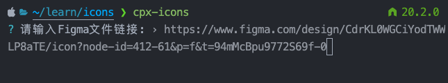
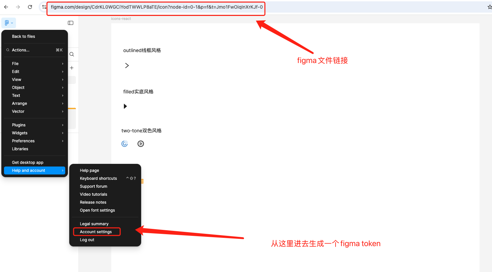
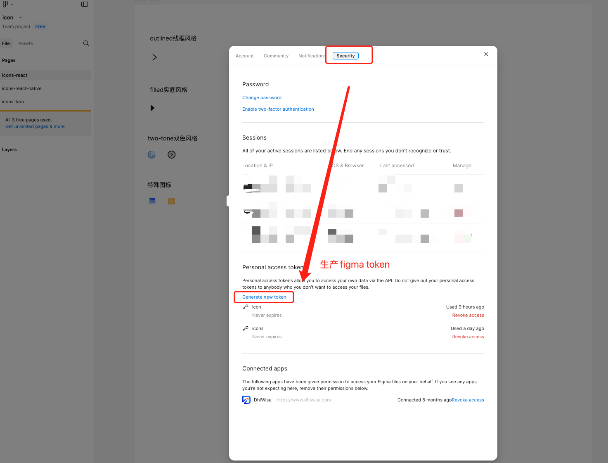
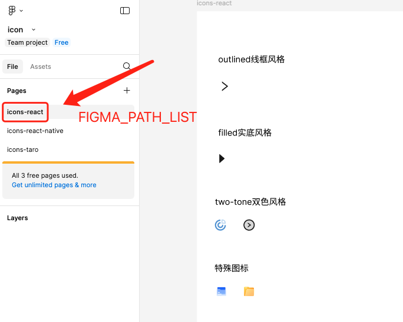

## 安装

### 通过 npm 安装

```bash
## npm
npm i @catpawx/icons-bin -g

## yarn
yarn add @catpawx/icons-bin -g

```

## 从figma自动生成icon到本地的脚本

> 目前可以通过三种方式来使用

### 通过交互式的脚本命令来生成图标

```bash
cpx-icons
```

- 会出现如图所示的交互式界面



- 请输入Figma文件链接



- 请输入Figma的token `放心输入这个插件不会保存任何token`



- 请输入FIGMA_PATH_LIST



- OUTPUT_DIR 生成代码的目录
- OUTPUT_TYPE 选择要生成代码的类型

### 通过命令行带参数的脚本命令来生成图标

```bash
cpx-icons --FIGMA_FILE_URL="https://www.figma.com/file/xxxxxx"  --FIGMA_TOKEN=figd_uGCU2xxxxxxx --FIGMA_PATH_LIST=icons-react --OUTPUT_TYPE=react --OUTPUT_DIR=icons
```

### 通过配置文件来生成图标

支持dotenv，所以可以在脚本执行的目录添加一个.env文件

```
# figma文件链接
FIGMA_FILE_URL=https://www.figma.com/file/xxxxxx
# figma的token
FIGMA_TOKEN=figd_uGCU29EKxrxxxxxxx
# 文件路径
FIGMA_PATH_LIST=icons-react
# 输出代码类型
OUTPUT_TYPE=react
# 输出代码目录
OUTPUT_DIR=icons
```
